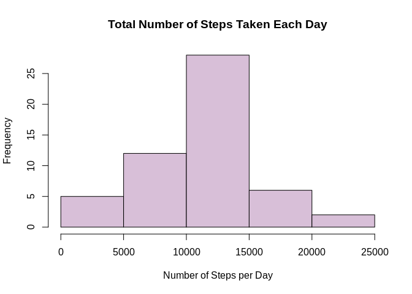
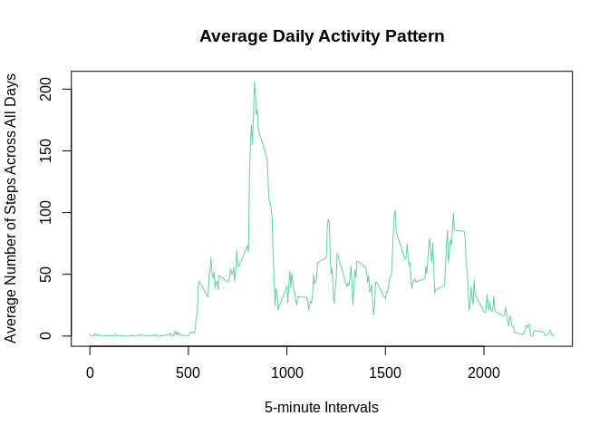
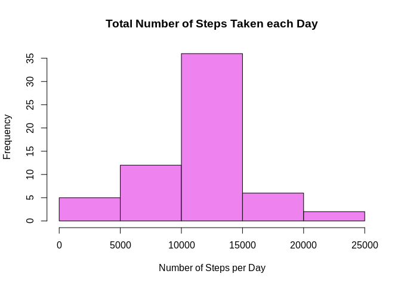
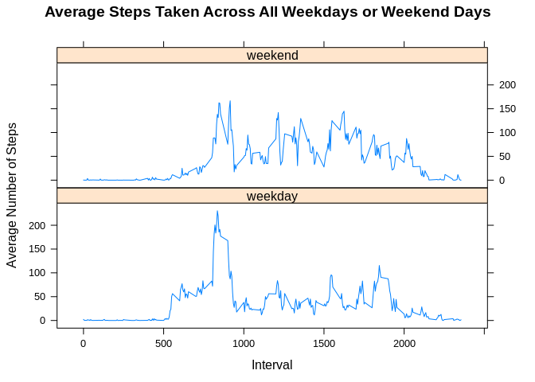

## Loading and preprocessing the data

1. Load the data.


```r
library(plyr)
```

2. Process/transform the data (if necessary) into a format suitable for your analysis.


```r
activity_data <- read.csv("./activity/activity.csv", header=TRUE)
```

## What is mean total number of steps taken per day?

1. Calculate the total number of steps taken per day.


```r
total_steps_day <- aggregate (steps ~ date, data = activity_data, FUN=sum, na.rm=TRUE)
total_steps_day
```

```
##          date steps
## 1  2012-10-02   126
## 2  2012-10-03 11352
## 3  2012-10-04 12116
## 4  2012-10-05 13294
## 5  2012-10-06 15420
## 6  2012-10-07 11015
## 7  2012-10-09 12811
## 8  2012-10-10  9900
## 9  2012-10-11 10304
## 10 2012-10-12 17382
## 11 2012-10-13 12426
## 12 2012-10-14 15098
## 13 2012-10-15 10139
## 14 2012-10-16 15084
## 15 2012-10-17 13452
## 16 2012-10-18 10056
## 17 2012-10-19 11829
## 18 2012-10-20 10395
## 19 2012-10-21  8821
## 20 2012-10-22 13460
## 21 2012-10-23  8918
## 22 2012-10-24  8355
## 23 2012-10-25  2492
## 24 2012-10-26  6778
## 25 2012-10-27 10119
## 26 2012-10-28 11458
## 27 2012-10-29  5018
## 28 2012-10-30  9819
## 29 2012-10-31 15414
## 30 2012-11-02 10600
## 31 2012-11-03 10571
## 32 2012-11-05 10439
## 33 2012-11-06  8334
## 34 2012-11-07 12883
## 35 2012-11-08  3219
## 36 2012-11-11 12608
## 37 2012-11-12 10765
## 38 2012-11-13  7336
## 39 2012-11-15    41
## 40 2012-11-16  5441
## 41 2012-11-17 14339
## 42 2012-11-18 15110
## 43 2012-11-19  8841
## 44 2012-11-20  4472
## 45 2012-11-21 12787
## 46 2012-11-22 20427
## 47 2012-11-23 21194
## 48 2012-11-24 14478
## 49 2012-11-25 11834
## 50 2012-11-26 11162
## 51 2012-11-27 13646
## 52 2012-11-28 10183
## 53 2012-11-29  7047
```


```r
# Convert dates to date format.
dates <- as.Date(activity_data$date, "%Y%m%d")
class(dates)
```

```
## [1] "Date"
```

2. Make a histogram of the total number of steps taken each day.


```r
# Make the histogram
hist(total_steps_day$steps, 
     main="Total Number of Steps Taken Each Day", 
     xlab="Number of Steps per Day", 
     ylab="Frequency", 
     col="thistle")
```

<!-- -->

3. Calculate and report the mean and median of the total number of steps taken per day.


```r
mean_steps <- mean(total_steps_day$steps)
mean_steps
```

```
## [1] 10766.19
```


```r
median_steps <- median(total_steps_day$steps)
median_steps
```

```
## [1] 10765
```


## What is the average daily activity pattern?

1. Make a time series plot of the 5-minute interval and the average number of steps taken, averaged across all days.


```r
avg_pattern <- aggregate(steps ~ interval, data=activity_data, FUN=mean, na.rm=TRUE)
```


```r
# Make the time series plot
plot(x=avg_pattern$interval, 
     y=avg_pattern$steps,
     type="l",
     col="aquamarine3",
     main="Average Daily Activity Pattern",
     xlab="5-minute Intervals",
     ylab="Average Number of Steps Across All Days")
```

<!-- -->


2. Which 5-minute interval, on average across all the days in the dataset, contains the maximum number of steps?


```r
max_steps <- avg_pattern$interval[which.max(avg_pattern$steps)]
max_steps
```

```
## [1] 835
```

## Imputing missing values

1. Calculate and report the total number of missing values in the dataset (i.e. the total number of rows with NAs).


```r
impute <- sum(is.na(activity_data$steps))
impute
```

```
## [1] 2304
```

2. Devise a strategy for filling in all of the missing values in the dataset.
3. Create a new dataset that is equal to the original dataset but with the missing data filled in.


```r
# Replace NA values with the mean results for five minute intervals
activity_data2 <- activity_data
nas <- is.na(activity_data2$steps)
avg_interval <- tapply(activity_data2$steps, activity_data2$interval, mean, na.rm=TRUE, simplify = TRUE)

# Create new dataset with missing values filled in
activity_data2$steps[nas] <- avg_interval[as.character(activity_data2$interval[nas])]
names(activity_data2)
```

```
## [1] "steps"    "date"     "interval"
```


```r
# Check that there are no missing values
sum(is.na(activity_data2))
```

```
## [1] 0
```

4. Make a histogram of the total number of steps taken each day and calculate and report the mean and median total number of steps taken per day. 


```r
total_steps_day2 <- aggregate(steps ~date, data=activity_data2, FUN=sum, na.rm=TRUE)
total_steps_day2
```

```
##          date    steps
## 1  2012-10-01 10766.19
## 2  2012-10-02   126.00
## 3  2012-10-03 11352.00
## 4  2012-10-04 12116.00
## 5  2012-10-05 13294.00
## 6  2012-10-06 15420.00
## 7  2012-10-07 11015.00
## 8  2012-10-08 10766.19
## 9  2012-10-09 12811.00
## 10 2012-10-10  9900.00
## 11 2012-10-11 10304.00
## 12 2012-10-12 17382.00
## 13 2012-10-13 12426.00
## 14 2012-10-14 15098.00
## 15 2012-10-15 10139.00
## 16 2012-10-16 15084.00
## 17 2012-10-17 13452.00
## 18 2012-10-18 10056.00
## 19 2012-10-19 11829.00
## 20 2012-10-20 10395.00
## 21 2012-10-21  8821.00
## 22 2012-10-22 13460.00
## 23 2012-10-23  8918.00
## 24 2012-10-24  8355.00
## 25 2012-10-25  2492.00
## 26 2012-10-26  6778.00
## 27 2012-10-27 10119.00
## 28 2012-10-28 11458.00
## 29 2012-10-29  5018.00
## 30 2012-10-30  9819.00
## 31 2012-10-31 15414.00
## 32 2012-11-01 10766.19
## 33 2012-11-02 10600.00
## 34 2012-11-03 10571.00
## 35 2012-11-04 10766.19
## 36 2012-11-05 10439.00
## 37 2012-11-06  8334.00
## 38 2012-11-07 12883.00
## 39 2012-11-08  3219.00
## 40 2012-11-09 10766.19
## 41 2012-11-10 10766.19
## 42 2012-11-11 12608.00
## 43 2012-11-12 10765.00
## 44 2012-11-13  7336.00
## 45 2012-11-14 10766.19
## 46 2012-11-15    41.00
## 47 2012-11-16  5441.00
## 48 2012-11-17 14339.00
## 49 2012-11-18 15110.00
## 50 2012-11-19  8841.00
## 51 2012-11-20  4472.00
## 52 2012-11-21 12787.00
## 53 2012-11-22 20427.00
## 54 2012-11-23 21194.00
## 55 2012-11-24 14478.00
## 56 2012-11-25 11834.00
## 57 2012-11-26 11162.00
## 58 2012-11-27 13646.00
## 59 2012-11-28 10183.00
## 60 2012-11-29  7047.00
## 61 2012-11-30 10766.19
```


```r
# Make the histogram
hist(total_steps_day2$steps,
     main="Total Number of Steps Taken each Day",
     xlab="Number of Steps per Day",
     ylab="Frequency",
     col="violet")
```

<!-- -->

Do these values differ from the estimates from the first part of the assignment? What is the impact of imputing missing data on the estimates of the total daily number of steps?


```r
summary(total_steps_day)
```

```
##          date        steps      
##  2012-10-02: 1   Min.   :   41  
##  2012-10-03: 1   1st Qu.: 8841  
##  2012-10-04: 1   Median :10765  
##  2012-10-05: 1   Mean   :10766  
##  2012-10-06: 1   3rd Qu.:13294  
##  2012-10-07: 1   Max.   :21194  
##  (Other)   :47
```


```r
summary(total_steps_day2)
```

```
##          date        steps      
##  2012-10-01: 1   Min.   :   41  
##  2012-10-02: 1   1st Qu.: 9819  
##  2012-10-03: 1   Median :10766  
##  2012-10-04: 1   Mean   :10766  
##  2012-10-05: 1   3rd Qu.:12811  
##  2012-10-06: 1   Max.   :21194  
##  (Other)   :55
```

Mean and median values are almost identical, but the quantiles are significantly different.

## Are there differences in activity patterns between weekdays and weekends?

1. Create a new factor variable in the dataset with two levels "weekday" and "weekend" indicating whether a given date is a weekday or weekend day.


```r
# Create variable with date in correct format
activity_data2$formatted_date <- as.Date(activity_data2$date, format = "%Y-%m-%d")

# Create a variable with weekdays name
activity_data2$weekday <- weekdays(activity_data2$formatted_date)

# Create a new variable indicating type of the day (weekday or weekend)
activity_data2$day_type <- ifelse(activity_data2$weekday=='Saturday' | activity_data2$weekday=='Sunday', 'weekend','weekday')
```


```r
head(activity_data2)
```

```
##       steps       date interval formatted_date weekday day_type
## 1 1.7169811 2012-10-01        0     2012-10-01  Monday  weekday
## 2 0.3396226 2012-10-01        5     2012-10-01  Monday  weekday
## 3 0.1320755 2012-10-01       10     2012-10-01  Monday  weekday
## 4 0.1509434 2012-10-01       15     2012-10-01  Monday  weekday
## 5 0.0754717 2012-10-01       20     2012-10-01  Monday  weekday
## 6 2.0943396 2012-10-01       25     2012-10-01  Monday  weekday
```

2. Make a panel plot containing a time series plot of the 5-minute interval (x-axis) and the average number of steps taken, averaged across all weekday days or weekend days (y-axis).
c

```r
# Create new data frame containing average number of steps, interval and day_type
activity_data3 <- aggregate(steps ~ interval + day_type, data=activity_data2, FUN=mean, na.rm=TRUE)
head(activity_data3)
```

```
##   interval day_type      steps
## 1        0  weekday 2.25115304
## 2        5  weekday 0.44528302
## 3       10  weekday 0.17316562
## 4       15  weekday 0.19790356
## 5       20  weekday 0.09895178
## 6       25  weekday 1.59035639
```


```r
library(lattice)
```


```r
# Convert day_type variable to a factor vector with two levels (weekday and weekend)
as.factor(activity_data3$day_type)
```

```
##   [1] weekday weekday weekday weekday weekday weekday weekday weekday
##   [9] weekday weekday weekday weekday weekday weekday weekday weekday
##  [17] weekday weekday weekday weekday weekday weekday weekday weekday
##  [25] weekday weekday weekday weekday weekday weekday weekday weekday
##  [33] weekday weekday weekday weekday weekday weekday weekday weekday
##  [41] weekday weekday weekday weekday weekday weekday weekday weekday
##  [49] weekday weekday weekday weekday weekday weekday weekday weekday
##  [57] weekday weekday weekday weekday weekday weekday weekday weekday
##  [65] weekday weekday weekday weekday weekday weekday weekday weekday
##  [73] weekday weekday weekday weekday weekday weekday weekday weekday
##  [81] weekday weekday weekday weekday weekday weekday weekday weekday
##  [89] weekday weekday weekday weekday weekday weekday weekday weekday
##  [97] weekday weekday weekday weekday weekday weekday weekday weekday
## [105] weekday weekday weekday weekday weekday weekday weekday weekday
## [113] weekday weekday weekday weekday weekday weekday weekday weekday
## [121] weekday weekday weekday weekday weekday weekday weekday weekday
## [129] weekday weekday weekday weekday weekday weekday weekday weekday
## [137] weekday weekday weekday weekday weekday weekday weekday weekday
## [145] weekday weekday weekday weekday weekday weekday weekday weekday
## [153] weekday weekday weekday weekday weekday weekday weekday weekday
## [161] weekday weekday weekday weekday weekday weekday weekday weekday
## [169] weekday weekday weekday weekday weekday weekday weekday weekday
## [177] weekday weekday weekday weekday weekday weekday weekday weekday
## [185] weekday weekday weekday weekday weekday weekday weekday weekday
## [193] weekday weekday weekday weekday weekday weekday weekday weekday
## [201] weekday weekday weekday weekday weekday weekday weekday weekday
## [209] weekday weekday weekday weekday weekday weekday weekday weekday
## [217] weekday weekday weekday weekday weekday weekday weekday weekday
## [225] weekday weekday weekday weekday weekday weekday weekday weekday
## [233] weekday weekday weekday weekday weekday weekday weekday weekday
## [241] weekday weekday weekday weekday weekday weekday weekday weekday
## [249] weekday weekday weekday weekday weekday weekday weekday weekday
## [257] weekday weekday weekday weekday weekday weekday weekday weekday
## [265] weekday weekday weekday weekday weekday weekday weekday weekday
## [273] weekday weekday weekday weekday weekday weekday weekday weekday
## [281] weekday weekday weekday weekday weekday weekday weekday weekday
## [289] weekend weekend weekend weekend weekend weekend weekend weekend
## [297] weekend weekend weekend weekend weekend weekend weekend weekend
## [305] weekend weekend weekend weekend weekend weekend weekend weekend
## [313] weekend weekend weekend weekend weekend weekend weekend weekend
## [321] weekend weekend weekend weekend weekend weekend weekend weekend
## [329] weekend weekend weekend weekend weekend weekend weekend weekend
## [337] weekend weekend weekend weekend weekend weekend weekend weekend
## [345] weekend weekend weekend weekend weekend weekend weekend weekend
## [353] weekend weekend weekend weekend weekend weekend weekend weekend
## [361] weekend weekend weekend weekend weekend weekend weekend weekend
## [369] weekend weekend weekend weekend weekend weekend weekend weekend
## [377] weekend weekend weekend weekend weekend weekend weekend weekend
## [385] weekend weekend weekend weekend weekend weekend weekend weekend
## [393] weekend weekend weekend weekend weekend weekend weekend weekend
## [401] weekend weekend weekend weekend weekend weekend weekend weekend
## [409] weekend weekend weekend weekend weekend weekend weekend weekend
## [417] weekend weekend weekend weekend weekend weekend weekend weekend
## [425] weekend weekend weekend weekend weekend weekend weekend weekend
## [433] weekend weekend weekend weekend weekend weekend weekend weekend
## [441] weekend weekend weekend weekend weekend weekend weekend weekend
## [449] weekend weekend weekend weekend weekend weekend weekend weekend
## [457] weekend weekend weekend weekend weekend weekend weekend weekend
## [465] weekend weekend weekend weekend weekend weekend weekend weekend
## [473] weekend weekend weekend weekend weekend weekend weekend weekend
## [481] weekend weekend weekend weekend weekend weekend weekend weekend
## [489] weekend weekend weekend weekend weekend weekend weekend weekend
## [497] weekend weekend weekend weekend weekend weekend weekend weekend
## [505] weekend weekend weekend weekend weekend weekend weekend weekend
## [513] weekend weekend weekend weekend weekend weekend weekend weekend
## [521] weekend weekend weekend weekend weekend weekend weekend weekend
## [529] weekend weekend weekend weekend weekend weekend weekend weekend
## [537] weekend weekend weekend weekend weekend weekend weekend weekend
## [545] weekend weekend weekend weekend weekend weekend weekend weekend
## [553] weekend weekend weekend weekend weekend weekend weekend weekend
## [561] weekend weekend weekend weekend weekend weekend weekend weekend
## [569] weekend weekend weekend weekend weekend weekend weekend weekend
## Levels: weekday weekend
```


```r
# Make the plot 
xyplot(steps ~ interval|day_type, data=activity_data3, type="l",  layout = c(1,2),
       main="Average Steps Taken Across All Weekdays or Weekend Days",
       ylab="Average Number of Steps", xlab="Interval")
```

<!-- -->

There are some differences in activity patterns between weekdays and weekends. There is generally more activity on weekends than on weekdays. 
